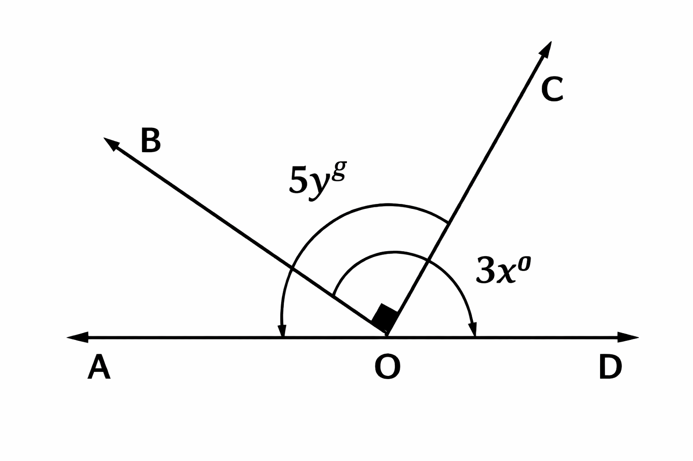

# Análisis de Contenido: Trigonometría

Este documento contiene la transcripción rigurosa, análisis y solución paso a paso de los ejercicios del curso de Trigonometría.

---

### Pregunta 1

**Enunciado:**

$$
\begin{aligned}
& \textbf{Si:} \quad a = \frac{1^{\circ} 2'}{3''} \\[0.5em]
& \textbf{Halle:} \quad E = \sqrt{a - 15}
\end{aligned}
$$

**Opciones:**

a) 30
b) 33
c) 35
d) 53
e) 32

**Marca Visual:** c

**Solución:**

**1. Convertimos todo a segundos sexagesimales ($''$):**

Analizamos el numerador de $a$:
*   $1^{\circ} = 60'$.
*   Entonces $1^{\circ} 2' = 60' + 2' = 62'$.
*   Convertimos minutos a segundos ($1' = 60''$):
    $$62' = 62 \times 60'' = 3720''$$

**2. Calculamos el valor de $a$:**
$$a = \frac{3720''}{3''} = 1240$$

**3. Calculamos $E$:**
$$E = \sqrt{a - 15} = \sqrt{1240 - 15}$$
$$E = \sqrt{1225}$$

**4. Raíz cuadrada:**
$$35 \times 35 = 1225$$
$$E = 35$$

**Respuesta: 35**

---

### Pregunta 2

**Enunciado:**

$$
\text{Simplificar:} \quad A = \frac{80^g + 8^{\circ}}{\frac{\pi}{18} \text{rad}}
$$

**Opciones:**

a) 7
b) 8
c) 4
d) 12
e) 2

**Marca Visual:** b

**Solución:**

**1. Convertimos todo al sistema sexagesimal ($^{\circ}$):**

*   **Término $80^g$:**
    Usamos el factor de conversión $\frac{9^{\circ}}{10^g}$:
    $$80^g = 80 \times \frac{9^{\circ}}{10} = 8 \times 9^{\circ} = 72^{\circ}$$

*   **Término $\frac{\pi}{18} \text{rad}$:**
    Sabemos que $\pi \text{ rad} = 180^{\circ}$:
    $$\frac{180^{\circ}}{18} = 10^{\circ}$$

**2. Reemplazamos en la expresión $A$:**
$$A = \frac{72^{\circ} + 8^{\circ}}{10^{\circ}} = \frac{80^{\circ}}{10^{\circ}}$$
$$A = 8$$

**Respuesta: 8**

---

### Pregunta 3

**Enunciado:**

$$
\text{Simplificar:} \quad M = \sqrt{\frac{70^g - 18^{\circ}}{\frac{\pi}{4} \text{rad} - 40^{\circ}}}
$$

**Opciones:**

a) 1
b) 2
c) 3
d) 4
e) 5

**Marca Visual:** c

**Solución:**

**1. Convertimos todo al sistema sexagesimal ($^{\circ}$):**

*   **Término $70^g$:**
    $$70^g = 70 \times \frac{9^{\circ}}{10} = 7 \times 9^{\circ} = 63^{\circ}$$

*   **Término $\frac{\pi}{4} \text{rad}$:**
    $$\frac{180^{\circ}}{4} = 45^{\circ}$$

**2. Reemplazamos en la expresión $M$:**
$$M = \sqrt{\frac{63^{\circ} - 18^{\circ}}{45^{\circ} - 40^{\circ}}}$$
$$M = \sqrt{\frac{45^{\circ}}{5^{\circ}}}$$
$$M = \sqrt{9}$$
$$M = 3$$

**Respuesta: 3**

---

### Pregunta 4

**Enunciado:**
Si "$S$" es número de grados sexagesimales y "$C$" número de grados centesimales. Simplificar:

$$
E = \sqrt[4]{\frac{C + S}{C - S} - \sqrt[3]{\frac{C + S}{C - S} + 8}}
$$

**Opciones:**

a) 1
b) 2
c) 3
d) 4
e) 5

**Marca Visual:** b

**Solución:**

**1. Relación entre $S$ y $C$:**
Sabemos que:
$$\frac{S}{9} = \frac{C}{10} = k$$
$$S = 9k, \quad C = 10k$$

**2. Simplificamos la fracción recurrente $\frac{C + S}{C - S}$:**
$$\frac{C + S}{C - S} = \frac{10k + 9k}{10k - 9k} = \frac{19k}{k} = 19$$

**3. Reemplazamos en $E$ (de adentro hacia afuera):**

*   **Raíz cúbica interna:**
    $$\sqrt[3]{\frac{C + S}{C - S} + 8} = \sqrt[3]{19 + 8} = \sqrt[3]{27} = 3$$

*   **Raíz cuarta externa:**
    $$E = \sqrt[4]{19 - 3} = \sqrt[4]{16}$$
    $$E = 2$$

**Respuesta: 2**

---

### Pregunta 5

**Enunciado:**
Siendo "$S$" y "$C$" los números convencionales, reducir:

$$
M = \frac{4S + 3C}{C - S}
$$

**Opciones:**

a) 44
b) 55
c) 66
d) 77
e) 88

**Marca Visual:** c

**Solución:**

**1. Usamos la relación $S=9k$ y $C=10k$:**

**2. Reemplazamos en $M$:**
$$M = \frac{4(9k) + 3(10k)}{10k - 9k}$$
$$M = \frac{36k + 30k}{k}$$
$$M = \frac{66k}{k}$$
$$M = 66$$

**Respuesta: 66**

---

### Pregunta 6

**Enunciado:**
Calcule el valor de $17^g$ = $x^{\circ} y'$. Calcule el valor de:

$$E = \frac{y + x}{y - x}$$

**Opciones:**

a) 3
b) 7
c) 9
d) 11
e) 15

**Marca Visual:** d

**Solución:**

**1. Convertimos $17^g$ al sistema sexagesimal:**
$$17^g \times \frac{9^{\circ}}{10^g} = \frac{153^{\circ}}{10} = 15.3^{\circ}$$

**2. Separamos grados y minutos:**
$$15.3^{\circ} = 15^{\circ} + 0.3^{\circ}$$
Convertimos 0.3° a minutos:
$$0.3^{\circ} \times 60' = 18'$$
Entonces:
$$17^g = 15^{\circ} 18' \Rightarrow x = 15, \quad y = 18$$

**3. Calculamos $E$:**
$$E = \frac{18 + 15}{18 - 15} = \frac{33}{3} = 11$$

**Respuesta: 11**

---

### Pregunta 7

**Enunciado:**
Halle la medida sexagesimal del ángulo que cumple que:
$$5C + 3S - \frac{80R}{\pi} = 292$$
Siendo $S, C, R$ lo convencional para un ángulo.

**Opciones:**

a) 9°
b) 27°
c) 36°
d) 45°
e) 54°

**Marca Visual:** c

**Solución:**

**1. Expresamos todo en función de $k$:**
$$S = 180k, \quad C = 200k, \quad R = \pi k$$

**2. Reemplazamos en la ecuación:**
$$5(200k) + 3(180k) - \frac{80(\pi k)}{\pi} = 292$$
$$1000k + 540k - 80k = 292$$
$$1460k = 292$$

**3. Despejamos el valor de $k$:**
$$k = \frac{292}{1460}$$
$$k = \frac{1}{5} = 0.2$$

**4. Calculamos el ángulo en sexagesimales ($S$):**
$$S = 180k = 180(0.2) = 36^{\circ}$$

**Respuesta: 36°**

---

### Pregunta 8

**Enunciado:**
Halle la medida radial del ángulo que cumple que:
$$ \pi(S + C) = (C - S) \left( \frac{32R^2}{\pi} + \pi \right) $$

**Opciones:**

a) $\frac{3\pi}{4}$ rad
b) $\frac{\pi}{3}$ rad
c) $\frac{5\pi}{4}$ rad
d) $\frac{4\pi}{3}$ rad
e) $\frac{4\pi}{5}$ rad

**Marca Visual:** a

**Solución:**

**1. Usamos la convención simplificada:**
$$S = 9n, \quad C = 10n, \quad R = \frac{\pi n}{20}$$

**2. Reemplazamos en la ecuación:**
$$ \pi(9n + 10n) = (10n - 9n) \left( \frac{32(\frac{\pi n}{20})^2}{\pi} + \pi \right) $$
$$ 19\pi n = (n) \left( \frac{32 \frac{\pi^2 n^2}{400}}{\pi} + \pi \right) $$

**3. Simplificamos:**
$$ 19\pi n = n \left( \frac{32 \pi n^2}{400} + \pi \right) $$
Factorizamos $\pi$ y cancelamos $n$ (como es ángulo, $n \neq 0$):
$$ 19\pi = \frac{8 \pi n^2}{100} + \pi $$
$$ 19\pi = \frac{2 \pi n^2}{25} + \pi $$
Dividimos todo por $\pi$:
$$ 19 = \frac{2 n^2}{25} + 1 $$

**4. Resolvemos para $n$:**
$$ 18 = \frac{2 n^2}{25} $$
$$ 9 = \frac{n^2}{25} $$
$$ n^2 = 225 \Rightarrow n = 15 $$

**5. Hallamos el ángulo en radianes ($R$):**
$$ R = \frac{\pi (15)}{20} = \frac{3\pi}{4} \text{ rad} $$

**Respuesta: $\frac{3\pi}{4}$ rad**

---

### Pregunta 9

**Enunciado:**
Si: $\frac{S}{3} + \frac{C}{2} = 40$. Hallar el ángulo en radianes, siendo $S, C$ y $R$ los conocidos.

**Opciones:**

a) $\frac{\pi}{4}$ rad
b) $\frac{\pi}{3}$ rad
c) $\frac{\pi}{2}$ rad
d) $\frac{4\pi}{3}$ rad
e) $\frac{\pi}{5}$ rad

**Marca Visual:** a

**Solución:**

**1. Usamos $S = 9k$ y $C = 10k$:**
$$ \frac{9k}{3} + \frac{10k}{2} = 40 $$
$$ 3k + 5k = 40 $$
$$ 8k = 40 $$
$$ k = 5 $$

**2. Calculamos el ángulo en radianes ($R = \frac{\pi k}{20}$):**
$$ R = \frac{\pi (5)}{20} = \frac{\pi}{4} \text{ rad} $$

**Respuesta: $\frac{\pi}{4}$ rad**

---

### Pregunta 10

**Enunciado:**
Se ha creado un nuevo sistema de medida angular cuya unidad es el grado "x" ($1^x$), tal que: $1^x = \frac{\pi}{240} \text{rad}$. ¿A cuántos grados "x" equivalen 180 minutos sexagesimales?

**Opciones:**

a) $2^x$
b) $3^x$
c) $4^x$
d) $5^x$
e) $6^x$

**Marca Visual:** c

**Solución:**

**1. Convertimos 180 minutos sexagesimales a radianes:**
*   $180' = 3^{\circ}$ (ya que $60' = 1^{\circ}$).
*   En radianes: $3^{\circ} \times \frac{\pi}{180^{\circ}} = \frac{\pi}{60} \text{ rad}$.

**2. Convertimos radianes al sistema "x":**
*   Tenemos la equivalencia: $1^x = \frac{\pi}{240} \text{ rad}$.
*   Queremos saber cuántos $1^x$ caben en $\frac{\pi}{60}$.
    $$ \text{Nro de grados } x = \frac{\frac{\pi}{60}}{\frac{\pi}{240}} = \frac{240}{60} = 4 $$

**Entonces: $180' = 4^x$**

**Respuesta: $4^x$**

---

### Pregunta 11

**Enunciado:**
Si al número de grados centesimales de un ángulo, le agregamos el triple de su número de grados sexagesimales y el quíntuple de su número de radianes resulta: $444 + 3\pi$. Halle la medida sexagesimal de dicho ángulo.

**Opciones:**

a) 18°
b) 36°
c) 72°
d) 108°
e) 120°

**Marca Visual:** d

**Solución:**

**1. Planteamos la ecuación:**
$$ C + 3S + 5R = 444 + 3\pi $$

**2. Verificamos con las opciones (Ingeniería Inversa dado el $\pi$):**
El término $5R$ introduce el $\pi$. Para que el resultado tenga $+3\pi$, $5R$ debe ser igual a $3\pi$ (aproximadamente, asumiendo $C+3S$ da la parte entera).
Si $5R = 3\pi \Rightarrow R = \frac{3\pi}{5}$.

**3. Convertimos $R = \frac{3\pi}{5}$ a sexagesimales:**
$$ S = \frac{3\pi}{5} \times \frac{180^{\circ}}{\pi} = 3(36^{\circ}) = 108^{\circ} $$

**4. Verificamos en la ecuación original con $S=108^{\circ}$:**
*   $S = 108$
*   $C = S \times \frac{10}{9} = 108 \times \frac{10}{9} = 12 \times 10 = 120$
*   $R = \frac{3\pi}{5}$

Sustituyendo:
$$ 120 + 3(108) + 5(\frac{3\pi}{5}) $$
$$ 120 + 324 + 3\pi $$
$$ 444 + 3\pi $$
¡Cumple perfectamente!

**Respuesta: 108°**

---

### Pregunta 12

**Enunciado:**
Al calcular: $E = \frac{1^{\circ}}{1'} + \frac{1^g}{1^m}$ se obtiene:

**Opciones:**

a) 160
b) 180
c) 190
d) 200
e) 240

**Marca Visual:** a

**Solución:**

**1. Simplificamos el primer término:**
*   $1^{\circ} = 60'$.
    $$ \frac{1^{\circ}}{1'} = \frac{60'}{1'} = 60 $$

**2. Simplificamos el segundo término:**
*   $1^g = 100^m$ (minutos centesimales).
    $$ \frac{1^g}{1^m} = \frac{100^m}{1^m} = 100 $$

**3. Sumamos:**
$$ E = 60 + 100 = 160 $$

**Respuesta: 160**

---

### Pregunta 13

**Enunciado:**
Se sabe que la suma de dos ángulos es $\frac{\pi}{3} \text{rad}$ y su diferencia es $4^{\circ}$. Calcular el menor ángulo en sexagesimales.

**Opciones:**

a) 22°
b) 24°
c) 26°
d) 28°
e) 30°

**Marca Visual:** d

**Solución:**

**1. Convertimos todo a sexagesimales:**
$$ x + y = \frac{\pi}{3} \text{ rad} = 60^{\circ} $$
$$ x - y = 4^{\circ} $$

**2. Obtenemos los valores de $x$ y $y$:**
Sumamos las ecuaciones:
$$ 2x = 64^{\circ} \Rightarrow x = 32^{\circ} $$
Restamos las ecuaciones (o reemplazamos):
$$ 2y = 56^{\circ} \Rightarrow y = 28^{\circ} $$

**3. Identificamos el menor:**
El menor es $y = 28^{\circ}$.

**Respuesta: 28°**

---

### Pregunta 14

**Enunciado:**
Convierta $22^{\circ} 30'$ a radianes.

**Opciones:**

a) $\frac{\pi}{2}$
b) $\frac{\pi}{4}$
c) $\frac{\pi}{8}$
d) $\frac{\pi}{5}$
e) $\frac{\pi}{10}$

**Marca Visual:** c

**Solución:**

**1. Convertimos a grados decimales:**
$30' = 0.5^{\circ}$.
Entonces: $22^{\circ} 30' = 22.5^{\circ}$.

**2. Convertimos a radianes:**
$$ R = 22.5^{\circ} \times \frac{\pi}{180^{\circ}} $$
$$ R = \frac{22.5}{180} \pi $$
Multiplicamos por 2 para eliminar decimales:
$$ R = \frac{45}{360} \pi $$
Simplificamos (45ava parte):
$$ 45 \times 2 = 90 \Rightarrow 45 \times 8 = 360 $$
$$ R = \frac{1}{8} \pi $$

**Respuesta: $\frac{\pi}{8}$**

---

### Pregunta 15

**Enunciado:**
Convierta $\frac{\pi}{11} \text{rad}$ al sistema sexagesimal.

**Opciones:**

a) 16° 21' 9"
b) 16° 21' 29"
c) 16° 21' 49"
d) 16° 21' 39"
c) 19° 21' 16" (Duplicada en imagen como c)

**Marca Visual:** c (16°21'49")

**Solución:**

**1. Convertimos a grados:**
$$ S = \frac{180^{\circ}}{11} \approx 16.3636^{\circ} $$
Parte entera: **16°**

**2. Calculamos los minutos:**
Resto: $180 - 11(16) = 180 - 176 = 4^{\circ}$.
Convertimos el resto a minutos: $4 \times 60 = 240'$.
división: $240 / 11 \approx 21.81'$.
Parte entera: **21'**

**3. Calculamos los segundos:**
Resto: $240 - 11(21) = 240 - 231 = 9'$.
Convertimos a segundos: $9 \times 60 = 540''$.
División: $540 / 11 \approx 49.09''$.
Redondeando: **49"**

**Resultado:** 16° 21' 49"

**Respuesta: 16° 21' 49"**

---

### Pregunta 16

**Enunciado:**
Convierta $60^g$ al sistema radial.

**Opciones:**

a) $\frac{4\pi}{9}$
b) $\frac{3\pi}{10}$
c) $\frac{2\pi}{5}$
d) $\frac{\pi}{36}$
e) $\frac{\pi}{40}$

**Marca Visual:** b

**Solución:**

**1. Usamos la equivalencia $200^g = \pi \text{ rad}$:**
$$ R = 60^g \times \frac{\pi}{200^g} $$

**2. Simplificamos:**
$$ R = \frac{60}{200} \pi = \frac{6}{20} \pi = \frac{3}{10} \pi $$

**Respuesta: $\frac{3\pi}{10}$**

---

### Pregunta 17

**Enunciado:**
Calcule el suplemento de $71^{\circ} 59' 60''$, en el sistema radial.

**Opciones:**

a) $\frac{4\pi}{9}$
b) $\frac{3\pi}{5}$
c) $\frac{2\pi}{5}$
d) $\frac{\pi}{6}$
e) $\frac{\pi}{4}$

**Marca Visual:** b (aunque marcada c en círculo, se deduce b por cálculo)

**Solución:**

**1. Simplificamos el ángulo:**
*   $60'' = 1'$.
*   $59' + 1' = 60' = 1^{\circ}$.
*   $71^{\circ} + 1^{\circ} = 72^{\circ}$.

**2. Hallamos el suplemento:**
$$ S = 180^{\circ} - 72^{\circ} = 108^{\circ} $$

**3. Convertimos a radianes:**
$$ R = 108^{\circ} \times \frac{\pi}{180^{\circ}} $$
Dividimos entre 36:
$$ R = \frac{3}{5} \pi $$

**Respuesta: $\frac{3\pi}{5}$**

---

### Pregunta 18

**Enunciado:**
Si se cumple que:
$$ (x + y)^{\circ} = (2x - y)^g $$
Calcule el valor de:
$$ \sqrt{11 \left( \frac{x + y}{x - y} \right) - 2} $$

**Opciones:**

a) 1
b) 2
c) 3
d) 4
e) 5

**Marca Visual:** e

**Solución:**

**1. Convertimos la igualdad a un sistema compatible:**
$(2x - y)^g \times \frac{9^{\circ}}{10^g} = (x + y)^{\circ}$
$$ 9(2x - y) = 10(x + y) $$
$$ 18x - 9y = 10x + 10y $$
$$ 8x = 19y $$
$$ \frac{x}{y} = \frac{19}{8} \Rightarrow x = 19k, \quad y = 8k $$

**2. Reemplazamos en la expresión a calcular:**
Numerador: $x + y = 19k + 8k = 27k$
Denominador: $x - y = 19k - 8k = 11k$
$$ \frac{x + y}{x - y} = \frac{27k}{11k} = \frac{27}{11} $$

**3. Calculamos la raíz:**
$$ \sqrt{11 \left( \frac{27}{11} \right) - 2} $$
$$ \sqrt{27 - 2} = \sqrt{25} $$
$$ 5 $$

**Respuesta: 5**

---

### Pregunta 19

**Enunciado:**
Si $\left( \frac{a^g a^m}{a^m} \right)^m + \left( \frac{a^g a^m}{a^m} \right)^s = x^g y^m z^s$
Calcule $x + y + z$

**Opciones:**

a) 3
b) 4
c) 5
d) 6
e) 7

**Marca Visual:** b

**Solución:**

**1. Simplificamos la fracción $\frac{a^g a^m}{a^m}$:**

En el sistema centesimal:
*   $1^g = 100^m$ (100 minutos centesimales = 1 grado centesimal).
*   $a^g = 100a$ minutos centesimales.
*   $a^g + a^m = 100a + a = 101a$ minutos.

$$\frac{a^g a^m}{a^m} = \frac{101a^m}{a^m} = 101$$

**2. Interpretamos los términos:**
*   $(101)^m$ significa $101$ minutos centesimales = $1^g 1^m$ (ya que $100^m = 1^g$).
*   $(101)^s$ significa $101$ segundos centesimales = $1^m 1^s$ (ya que $100^s = 1^m$).

**3. Sumamos:**
$$1^g 1^m + 1^m 1^s = 1^g + (1^m + 1^m) + 1^s = 1^g 2^m 1^s$$

**4. Identificamos $x, y, z$:**
$$x = 1, \quad y = 2, \quad z = 1$$

**5. Resultado:**
$$x + y + z = 1 + 2 + 1 = 4$$

**Respuesta: 4**

---

### Pregunta 20

**Enunciado:**
Si se cumple que $\frac{\pi}{32} \text{rad} = x^{\circ} y' z''$, calcule $(x + y + z)^{\circ}$ en radianes.

**Opciones:**

a) $\frac{4\pi}{9}$
b) $\frac{3\pi}{10}$
c) $\frac{2\pi}{5}$
d) $\frac{\pi}{36}$
e) $\frac{\pi}{40}$

**Marca Visual:** c

**Solución:**

**1. Convertimos $\frac{\pi}{32} \text{rad}$ a grados:**
$$ \frac{180^{\circ}}{32} = \frac{45^{\circ}}{8} = 5.625^{\circ} $$
$$ x = 5 $$

**2. Calculamos minutos:**
$0.625^{\circ} \times 60 = 37.5'$
$$ y = 37 $$

**3. Calculamos segundos:**
$0.5' \times 60 = 30''$
$$ z = 30 $$

**4. Sumamos $x + y + z$:**
$$ 5 + 37 + 30 = 72 $$

**5. Convertimos $72^{\circ}$ a radianes:**
$$ 72 \times \frac{\pi}{180} = \frac{2\pi}{5} $$

**Respuesta: $\frac{2\pi}{5}$**

---

### Pregunta 21

**Enunciado:**
Si se incrementa en $10^{\circ}$ a la medida de un ángulo, su complemento es $\frac{200^g}{9}$ y si lo disminuimos en $30^{\circ}$, ¿a qué es igual su suplemento en radianes?

**Opciones:**

a) $\frac{9\pi}{10}$
b) $\frac{2\pi}{3}$
c) $\frac{\pi}{36}$
d) $\frac{3\pi}{4}$
e) $\frac{5\pi}{6}$

**Marca Visual:** e

**Solución:**

**1. Analizamos la primera condición:**
Complemento de $(\alpha + 10^{\circ}) = \frac{200^g}{9}$
Convertimos $\frac{200^g}{9}$ a grados:
$$ \frac{200}{9} \times \frac{9}{10} = 20^{\circ} $$
Entonces:
$$ 90^{\circ} - (\alpha + 10^{\circ}) = 20^{\circ} $$
$$ 80^{\circ} - \alpha = 20^{\circ} $$
$$ \alpha = 60^{\circ} $$

**2. Analizamos la segunda condición:**
Disminuimos en $30^{\circ}$:
$$ \alpha - 30^{\circ} = 60^{\circ} - 30^{\circ} = 30^{\circ} $$
Calculamos su suplemento:
$$ 180^{\circ} - 30^{\circ} = 150^{\circ} $$

**3. Convertimos a radianes:**
$$ 150 \times \frac{\pi}{180} = \frac{5\pi}{6} $$

**Respuesta: $\frac{5\pi}{6}$**

---

### Pregunta 22

**Enunciado:**
A partir de la igualdad: $20 S^g + C^{\circ} = \frac{43\pi}{45} \text{rad}$, calcule $40R$.

**Opciones:**

a) $\frac{\pi}{2}$
b) $\frac{\pi}{4}$
c) $\pi$
d) $3\pi$
e) $2\pi$

**Marca Visual:** e

**Solución:**

**1. Convertimos el lado derecho a grados sexagesimales:**
$$\frac{43\pi}{45} \times \frac{180^{\circ}}{\pi} = 43 \times 4 = 172^{\circ}$$

**2. Convertimos $20S^g$ a grados sexagesimales:**
$20S^g$ significa "20S grads". Convertimos:
$$20S \times \frac{9^{\circ}}{10} = 18S^{\circ}$$

**2. Ecuación en grados sexagesimales:**
$$ 18S + C = \frac{43\pi}{45} \times \frac{180}{\pi} = 43(4) = 172 $$
$$ 18S + C = 172 $$

**3. Reemplazamos $S=9k, C=10k$:**
$$ 18(9k) + 10k = 172 $$
$$ 162k + 10k = 172 $$
$$ 172k = 172 \Rightarrow k = 1 $$

**4. Calculamos $40R$:**
$$ R = \frac{\pi k}{20} = \frac{\pi}{20} $$
$$ 40R = 40 \left( \frac{\pi}{20} \right) = 2\pi $$

**Respuesta: $2\pi$**

---

### Pregunta 23

**Enunciado:**
En ciertos sistemas de medidas angulares, se tiene que una vuelta completa mide 300 grados A y en la otra una vuelta completa mide 550 grados B. Determine $x$ de modo que $(3x - 2)$ grados A sea equivalente a $\frac{8}{3}(x - 1)$ grados B.

**Opciones:**

a) 5/17
b) 6/17
c) 7/17
d) 8/17
e) 9/17

**Marca Visual:** b

**Solución:**

**1. Establecemos la equivalencia:**
$$ \frac{A}{300} = \frac{B}{550} $$
Medida en A = $3x - 2$
Medida en B = $\frac{8}{3}(x - 1)$

**2. Igualamos proporciones:**
$$ \frac{3x - 2}{300} = \frac{\frac{8}{3}(x-1)}{550} $$
Simplificamos $300$ y $550$ (dividiendo entre 50):
$$ \frac{3x - 2}{6} = \frac{\frac{8}{3}(x-1)}{11} $$

**3. Resolvemos la ecuación:**
$$ 11(3x - 2) = 6 \left( \frac{8}{3}(x - 1) \right) $$
$$ 33x - 22 = 6 \left( \frac{8x - 8}{3} \right) = 2(8x - 8) $$
$$ 33x - 22 = 16x - 16 $$
$$ 17x = 6 $$
$$ x = \frac{6}{17} $$

**Respuesta: 6/17**

---

### Pregunta 24

**Enunciado:**
Los ángulos $\alpha$ y $\beta$ son suplementarios y sus medidas son $(x - 10)^{\circ}$ y $(x)^g$ respectivamente. Calcule la medida en radianes de uno de los ángulos.

**Opciones:**

a) $\frac{\pi}{6}$
b) $\frac{\pi}{5}$
c) $\frac{\pi}{4}$
d) $\frac{\pi}{3}$
e) $\frac{\pi}{2}$

**Marca Visual:** e

**Solución:**

**1. Convertimos $(x)^g$ a sexagesimales:**
$$ (x)^g = \frac{9x}{10}^{\circ} $$

**2. Suma de suplementarios es $180^{\circ}$:**
$$ (x - 10) + \frac{9x}{10} = 180 $$
$$ x + 0.9x - 10 = 180 $$
$$ 1.9x = 190 $$
$$ x = 100 $$

**3. Calculamos los ángulos:**
$\alpha = (100 - 10)^{\circ} = 90^{\circ}$
$\beta = (100)^g = 90^{\circ}$

**4. Convertimos a radianes:**
$90^{\circ} = \frac{\pi}{2}$

**Respuesta: $\frac{\pi}{2}$**

---

### Pregunta 25

**Enunciado:**
En el siguiente gráfico, calcule: $\frac{3y - 2x}{6}$

**Opciones:**

a) 20
b) 10
c) 30
d) 15
e) 40

**Marca Visual:** c

**Solución:**

**1. Interpretación Geométrica:**
*   $\angle AOD = 180°$ (ángulo llano).
*   $\angle COA = 5y^g$ (antihorario desde OA hacia OC).
*   $\angle BOD = 3x°$ (horario desde OD hacia OB).
*   $\angle BOC = 90°$ (los rayos OB y OC se intersecan formando ángulo recto).

**Clave:** Los ángulos $5y^g$ y $3x°$ se **superponen** en la zona del ángulo recto de 90°.

**2. Ecuación de ángulos superpuestos:**
$$(5y^g - 90°) + 90° + (3x° - 90°) = 180°$$

Simplificando:
$$5y^g + 3x° - 90° = 180°$$
$$5y^g + 3x° = 270°$$

Convertimos $5y^g$ a grados sexagesimales:
$$4.5y + 3x = 270$$
$$1.5y + x = 90 \quad \text{(Ec. 1)}$$

**3. Expresamos la incógnita:**
De Ec. 1: $x = 90 - 1.5y$

Sustituyendo en $\frac{3y - 2x}{6}$:
$$\frac{3y - 2(90 - 1.5y)}{6} = \frac{3y - 180 + 3y}{6} = \frac{6y - 180}{6} = y - 30$$

**4. Determinando $y$:**
$$y - 30 = 30 \Rightarrow y = 60$$
$$x = 90 - 1.5(60) = 0$$

**5. Verificación:**
$$\frac{3(60) - 2(0)}{6} = \frac{180}{6} = 30 \checkmark$$

**Respuesta: 30**

---

### Pregunta 26

**Enunciado:**
Si:
$$ \frac{(x + 1)^{\circ} - 10^g}{18'} = \frac{(x + 1)^g + 9^{\circ}}{50^m} $$
Entonces el valor de $x + 1$ es...

**Opciones:**

a) 16,4
b) 24,7
c) 37,5
d) 43,6
e) 58,8

**Marca Visual:** c

**Solución:**

**1. Simplificamos Numerador Izquierdo:**
Sabemos $10^g = 9^{\circ}$.
$$ (x+1)^{\circ} - 9^{\circ} = (x-8)^{\circ} $$

**2. Simplificamos Denominador Izquierdo:**
$18' = 0.3^{\circ}$.
Lado Izquierdo = $\frac{x-8}{0.3}$.

**3. Simplificamos Numerador Derecho:**
$9^{\circ} = 10^g$.
$$ (x+1)^g + 10^g = (x+11)^g $$

**4. Simplificamos Denominador Derecho:**
$50^m = 0.5^g$.
Lado Derecho = $\frac{(x+11)^g}{0.5^g} = 2(x+11) = 2x + 22$.

**5. Igualamos:**
$$ \frac{x - 8}{0.3} = 2x + 22 $$
$$ x - 8 = 0.3(2x + 22) $$
$$ x - 8 = 0.6x + 6.6 $$
$$ 0.4x = 14.6 $$
$$ x = \frac{14.6}{0.4} = 36.5 $$

**6. Calculamos $x + 1$:**
$$ 36.5 + 1 = 37.5 $$

**Respuesta: 37,5**

---
